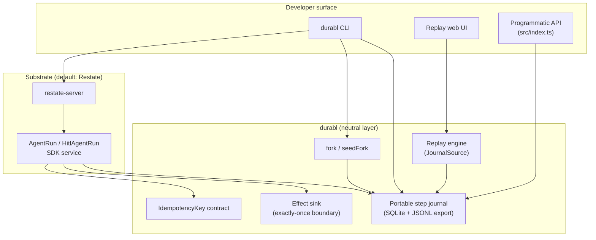

# durabl

**durabl** is a neutral, self-hostable **agent execution journal** with **replay /
time-travel**, **logical step-level fork**, and **human-in-the-loop pause/resume**.
It uses [Restate](https://restate.dev) as the durable step-journal substrate and
never relies on process snapshots (CRIU) — only portable journal records and
structural per-step idempotency.

**Wedge (what you get today):** a TypeScript library + CLI that proves durable
agent runs survive real crashes, fork to alternate trajectories without
re-firing side effects, reconstruct runs offline from JSONL exports, and resume
HITL workflows after a full substrate restart (CLI or replay UI).

Phase 0 showed the **durable execution engine** wedge is closed (Google AX,
Temporal, Restate, and others). durabl targets what remains: **your history in
your infra**, demonstrable offline after export. Investor narrative and live
demo script: [`docs/FUNDING.md`](docs/FUNDING.md),
[`docs/DEMO-NARRATIVE.md`](docs/DEMO-NARRATIVE.md),
[`docs/RISKS.md`](docs/RISKS.md).

## Quickstart

**Prerequisites:** Node.js **>= 22.5.0** (uses built-in `node:sqlite`). macOS or
Linux recommended for the adversarial harness.

```bash
npm install
npm run build          # optional; demo/test build automatically
npm run demo           # scripted M1+M2 narrative (real SIGKILL + fork)
npm run ui             # replay UI → http://127.0.0.1:7878
```

One-liner:

```bash
./scripts/quickstart.sh
```

CLI (after `npm run build`):

```bash
npx durabl --help
npx durabl runs
npx durabl replay <runId>
npx durabl ui --from export.jsonl   # fully offline
```

**Verify (CI-style):**

```bash
npm test              # M1 gate (== npm run gate)
npm run gate:m2       # logical fork gate
npm run gate:m3       # replay + offline UI APIs
npm run gate:m4       # provider/deploy neutrality
npm run gate:m5       # HITL pause/resume + export
npm run gate:hitl-ui  # HITL web UI resume + offline 503
npm run gate:live     # real LLM providers (skip if no API keys)
```

## Milestone proof

Full matrix, evidence paths, and reproduce commands:
[`docs/build-status.md`](docs/build-status.md).

| Milestone | Scope | Gate | Status |
|-----------|--------|------|--------|
| **M0** | Feasibility: fork + replay without engine mods | spike | ✅ |
| **M1** | Portable journal + structural exactly-once | `npm test` | ✅ 10/10 |
| **M2** | Logical trajectory fork + inspect APIs | `npm run gate:m2` | ✅ 6/6 |
| **M3** | Replay / time-travel + offline export + UI | `npm run gate:m3` | ✅ 5/5 |
| **M4** | Model + deploy neutrality (config-only) | `npm run gate:m4` | ✅ 4/4 |
| **M5** | HITL pause/resume across real restart | `npm run gate:m5` | ✅ 4/4 |

Deep dives: [`docs/m1-slice.md`](docs/m1-slice.md),
[`docs/m2-trajectory-branching.md`](docs/m2-trajectory-branching.md),
[`docs/m3-observability-replay.md`](docs/m3-observability-replay.md),
[`docs/m4-neutrality.md`](docs/m4-neutrality.md),
[`docs/m5-hitl-export.md`](docs/m5-hitl-export.md).

Phase 0 background: [`docs/phase0/`](docs/phase0/).

## Architecture



**Separation of concerns**

- **Workflow** orchestrates durable steps on Restate; it never touches SQLite directly.
- **Journal** owns persistence, export, and fork seeding.
- **Effect sink** requires a branded `IdempotencyKey` — the dual-write window is
  structurally deduped (see M1).
- **Replay** reads only `JournalSource` (live DB or imported JSONL); no live
  Restate state required for reconstruction.

## Optional: Restate in Docker

The default path uses **native** `restate-server` from npm (no Docker). For a
containerized substrate:

```bash
docker compose --profile docker-demo up -d
export DURABL_RESTATE_INGRESS=http://127.0.0.1:8080
export DURABL_RESTATE_ADMIN=http://127.0.0.1:9070
npm run service
npx restate deployments register http://host.docker.internal:9080
npm run demo
```

Stop: `docker compose --profile docker-demo down`.

## Layout

```
src/
  idempotency.ts      # branded IdempotencyKey
  step-model.ts       # neutral journal types (schema v1)
  journal.ts          # SQLite journal + JSONL export + forkRun
  effect-sink.ts      # exactly-once effect boundary
  workflow.ts         # reference agent loop on Restate
  replay.ts           # reconstruct / state-at
  fork.ts             # logical fork + forkAndRun
  cli.ts              # durabl CLI
  harness/            # adversarial gates + demo
web/                  # replay UI static assets
```

## Configuration

| Variable | Default | Purpose |
|----------|---------|---------|
| `DURABL_DATA_DIR` | `$TMPDIR/durabl-m1` | Root for journal/effect/engine data |
| `DURABL_JOURNAL_DB` | `<root>/journal.db` | Portable step journal |
| `DURABL_EFFECT_DB` | `<root>/effects.db` | Idempotent effect sink |
| `DURABL_SERVICE_PORT` | `9080` | Restate SDK service port |
| `DURABL_RESTATE_INGRESS` | `http://localhost:8080` | Restate ingress |
| `DURABL_RESTATE_ADMIN` | `http://localhost:9070` | Restate admin |

No credentials are read or logged; paths and ports only.

## Docs

| Doc | Purpose |
|-----|---------|
| [`docs/FAQ.md`](docs/FAQ.md) | Common questions (journal, replay, HITL, gates) |
| [`docs/TROUBLESHOOTING.md`](docs/TROUBLESHOOTING.md) | Harness lock, port conflicts, SIGKILL teardown, offline HITL 503 |
| [`docs/DEVELOPMENT.md`](docs/DEVELOPMENT.md) | Worktrees, serial gates, harness locking |
| [`docs/QUICKSTART.md`](docs/QUICKSTART.md) | First-run walkthrough |

## Contributing

See [`CONTRIBUTING.md`](CONTRIBUTING.md).

## License

Apache-2.0 — see [`LICENSE`](LICENSE).
