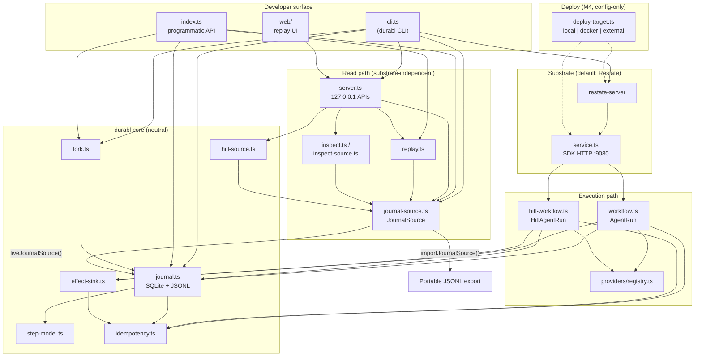

# durabl architecture

durabl is a **neutral, self-hostable agent execution journal** with replay,
time-travel, logical step-level fork, and human-in-the-loop (HITL) pause/resume.
The default **substrate** is [Restate](https://restate.dev) (crash-durable
`ctx.run` steps). The **product surface** is the portable step journal in SQLite
(exportable to JSONL), structural per-step idempotency, and read-only
reconstruction — not process snapshots.

This document matches the current `src/` tree. For milestone evidence and gates,
see [`build-status.md`](build-status.md).

---

## Layered model

| Layer | Role | Primary modules |
|-------|------|-----------------|
| **Substrate (Restate)** | Engine-level crash durability; workflow invocation; durable promises (HITL) | `service.ts`, `workflow.ts`, `hitl-workflow.ts`, `harness/restate-control.ts` |
| **Step model** | Substrate-agnostic types (schema v1) | `step-model.ts` |
| **Idempotency** | Branded `IdempotencyKey`; deterministic `runId:stepName` | `idempotency.ts` |
| **Journal** | Portable step log + lineage + fork seeding + export | `journal.ts` |
| **Effect sink** | Exactly-once side-effect boundary (SQLite dedup) | `effect-sink.ts` |
| **Workflow** | Reference agent loops; journal + sink inside `ctx.run` | `workflow.ts`, `hitl-workflow.ts` |
| **Fork** | Seed journal + invoke diverged run (injected substrate) | `fork.ts` |
| **JournalSource** | Read-only journal view (live SQLite or imported JSONL) | `journal-source.ts`, `journal-source-dbos-stub.ts` |
| **Replay** | Reconstruct / time-travel; no substrate | `replay.ts` |
| **Inspect** | Lineage, fork tree, trajectory diff (live or via source) | `inspect.ts`, `inspect-source.ts` |
| **Providers (M4)** | Config-selected model backends | `providers/*` |
| **Deploy target (M4)** | Config-selected Restate launch/endpoints | `deploy-target.ts` |
| **HITL bridge** | Pause state from journal; resume via ingress | `hitl-source.ts`, `journal.ts` (`hitlState`) |
| **UI / server** | Local replay APIs + static web | `server.ts`, `web/*` |
| **CLI** | Fork, replay, export, UI, HITL commands | `cli.ts` |
| **Public API** | Library re-exports | `index.ts` |
| **Config** | Env-based paths and Restate URLs | `config.ts` |
| **Harness** | Adversarial gates, demo, crash inject | `harness/*`, `crash-inject.ts` |

**Dual durability (by design):** Restate guarantees at-least-once execution of
step bodies across crashes. The durabl journal records each logical step output
once (short-circuit on replay/fork seed) and enforces idempotency keys at the
journal and effect-sink layers. Side effects may only fire through
`fireEffect(idempotencyKey, ...)`.

---

## System diagram



---

## Substrate (Restate)

- **`service.ts`** — Entry point: imports `workflow.ts` (and registers
  `hitl-workflow.ts` via that module) so `npm run service` serves the SDK on
  `DURABL_SERVICE_PORT` (default `9080`).
- **`workflow.ts`** — `AgentRun` workflow: three durable steps (plan → tool →
  summarize). Each step runs inside `ctx.run(...)` and persists via
  `recordStep` / `recordStepAsync`. Tool step calls `fireEffect`.
- **`hitl-workflow.ts`** — `HitlAgentRun`: plan → durable pause
  (`ctx.promise`) → human input → tool → summarize. Pause/resume survives
  process exit; journal records `hitl_pause` / `hitl_input` kinds.
- **`harness/restate-control.ts`** — Start/stop `restate-server`, register
  deployments (used by gates and demo).

Workflow code **never opens the journal database directly** for ad-hoc writes;
it goes through `journal.ts` helpers inside durable step bodies.

---

## Journal

**`journal.ts`** — Source of truth for the portable product:

- SQLite (`node:sqlite`) at `DURABL_JOURNAL_DB` (under `DURABL_DATA_DIR`).
- Tables: `step_journal` (entries keyed by `(run_id, seq)`; unique
  `(run_id, idem_key)`), `run_meta` (lineage: `parent_run`, `forked_at_seq`,
  `trajectory`).
- **`recordStep` / `recordStepAsync`** — Derive idempotency key, short-circuit if
  already recorded (replay and fork seed).
- **`forkRun`** — Copy entries with `seq <= N` into a new run (M1 primitive;
  used by `fork.ts`).
- **Export** — `exportJsonl`, `exportJsonlWithEffects`, `exportBundleJsonl`
  (whole fork tree + effects for offline replay).
- **HITL helpers** — `hitlState`, `pausedRuns` (journal-derived, not in-memory).

**`step-model.ts`** — `JournalEntry`, `RunMeta`, `StepKind`, workflow I/O types.
No Restate imports.

---

## Idempotency

**`idempotency.ts`** — Structural contract:

- `IdempotencyKey` is branded; only `deriveIdempotencyKey(runId, stepName)` or
  `asIdempotencyKey` (when reading stored rows) produce it.
- Format: `<runId>:<stepName>` with safe character validation.

The journal unique index on `(run_id, idem_key)` and the effect sink unique index
on `idem_key` enforce exactly-once **logical** effects across crash/replay.

---

## Effect sink

**`effect-sink.ts`** — SQLite at `DURABL_EFFECT_DB`:

- `fireEffect(runId, trajectory, stepName, idemKey, payload)` — Requires
  `IdempotencyKey`; dedupes physical re-fires.
- `effectsFor(runId)` — Used by inspect and replay.

---

## Workflow (reference agents)

| Service | Module | Purpose |
|---------|--------|---------|
| `AgentRun` | `workflow.ts` | M1–M4 reference loop; M4 model call inside journaled plan step |
| `HitlAgentRun` | `hitl-workflow.ts` | M5 pause/resume across substrate restart |

Both use **`getModelProvider()`** from `providers/registry.ts` (env
`DURABL_MODEL_PROVIDER`). Provider output is recorded once in the journal; replay
and fork never re-invoke the model for completed steps.

**`crash-inject.ts`** — Test-only SIGKILL hooks for harness gates.

---

## Fork

**`fork.ts`** — Product fork API on top of `forkRun`:

1. **Seed** — `seedFork` / `forkRun`: journal-only copy through seq `N`.
2. **Diverge** — `forkAndRun`: injected `SubstrateInvoke` (CLI posts to Restate
   ingress). Seeded steps short-circuit; only steps after `N` execute and can
   fire new effects.

**`inspect.ts`** — Read-only over live SQLite: `inspectRun`, `lineage`,
`listForks`, `forkTree`, `diffTrajectories`.

---

## Replay and JournalSource

**`journal-source.ts`** — Boundary for substrate-independent reads:

```ts
interface JournalSource {
  readonly origin: string;
  trajectory(runId: string): JournalEntry[];
  runMeta(runId: string): RunMeta | undefined;
  childRuns(parentRunId: string): RunMeta[];
  effectsFor(runId: string): EffectRow[];
  allRunIds(): string[];
}
```

| Implementation | Function | When |
|----------------|----------|------|
| Live SQLite | `liveJournalSource()` | Local run; UI/CLI default |
| Imported export | `importJournalSource(jsonl)` | Offline; no DB, no Restate |
| DBOS (stub) | `journal-source-dbos-stub.ts` | Second-substrate seam (M4); not default |

**`replay.ts`** — Consumes only `JournalSource`:

- `reconstruct`, `stateAt`, `divergencePoints`, `assertReplayMatches`,
  `compareSources`
- Read-only; no effects; no Restate.

**`inspect-source.ts`** — Same inspection operations as `inspect.ts` but
parameterized by `JournalSource` (used by `server.ts` and M3 gate).

---

## Providers (model neutrality)

```
src/providers/
  provider.ts           # ModelProvider interface
  registry.ts           # DURABL_MODEL_PROVIDER → implementation
  provider-errors.ts    # ProviderError, redactSecrets
  provider-http.ts      # fetchWithProviderPolicy
  fake-provider.ts      # fake-echo, fake-upper (default / gates)
  openai-provider.ts
  anthropic-provider.ts
  openrouter-provider.ts
```

Workflows depend on `ModelProvider`, not a vendor SDK. Switching providers is
**config-only** (see [`m4-neutrality.md`](m4-neutrality.md)).

---

## Deploy target

**`deploy-target.ts`** — Resolves where Restate runs (harness + docs):

| Target | `LaunchKind` | Notes |
|--------|--------------|-------|
| `local` | `local-binary` | Default; `restate-server` from npm |
| `docker` | `docker` | `restate` container; different ingress ports |
| (external) | `external` | Set `DURABL_RESTATE_INGRESS` / `_ADMIN` only |

Agent and workflow code do not branch on deploy target; only env endpoints change.

---

## UI and server

**`server.ts`** — `node:http` on `127.0.0.1` (override `DURABL_UI_HOST`):

- Builds a `JournalSource` from live DB, `--from` JSONL path, or injected source.
- JSON APIs: replay (`reconstruct`, `stateAt`), inspect (`forkTree`, `lineage`,
  `diff`), HITL paused runs; live-only `POST` resume proxies to Restate ingress.
- Serves static assets from `web/`.

**`web/`** — `index.html`, `app.js`, `app.css` — timeline, fork tree, step
detail, time-travel scrubber (see [`hitl-web-ui.md`](hitl-web-ui.md)).

---

## CLI and public API

**`cli.ts`** — Commands include: `runs`, `replay`, `state-at`, `fork`,
`inspect`/`lineage`/`forks`/`tree`/`diff`, `export`/`export-bundle`, `ui`,
`hitl-*`. Ingress invocations target `AgentRun` / `HitlAgentRun` on
`config.restateIngress`.

**`index.ts`** — Re-exports journal, replay, fork, inspect, providers, deploy,
HITL, and server entry — intentionally **does not** re-export Restate SDK types.

---

## Configuration

Centralized in **`config.ts`** (see README table):

- `DURABL_DATA_DIR`, `DURABL_JOURNAL_DB`, `DURABL_EFFECT_DB`
- `DURABL_SERVICE_PORT`, `DURABL_RESTATE_INGRESS`, `DURABL_RESTATE_ADMIN`
- Provider: `DURABL_MODEL_PROVIDER`
- Deploy: `DURABL_DEPLOY_TARGET` (via `deploy-target.ts`)

No secrets are read or logged in core paths.

---

## Source layout (`src/`)

```
src/
  index.ts                    # Public API exports
  config.ts                   # Env-based configuration
  step-model.ts               # Neutral journal / workflow types
  idempotency.ts              # IdempotencyKey contract
  journal.ts                  # SQLite journal, export, forkRun, HITL state
  effect-sink.ts              # Idempotent side-effect log
  workflow.ts                 # AgentRun (Restate)
  hitl-workflow.ts            # HitlAgentRun (Restate)
  service.ts                  # SDK service entry
  fork.ts                     # forkAndRun, seedFork, validation
  journal-source.ts           # JournalSource live + import
  journal-source-dbos-stub.ts # Second-substrate stub (optional)
  replay.ts                   # reconstruct / stateAt / assertReplayMatches
  inspect.ts                  # Inspection over live journal
  inspect-source.ts           # Inspection over JournalSource
  hitl-source.ts              # HITL state + ingress resume for UI
  server.ts                   # Replay UI HTTP server
  cli.ts                      # durabl CLI
  deploy-target.ts            # local / docker / external Restate
  crash-inject.ts             # Harness crash points
  providers/
    provider.ts
    registry.ts
    provider-errors.ts
    provider-http.ts
    fake-provider.ts
    openai-provider.ts
    anthropic-provider.ts
  harness/
    run-gate.ts               # M1 gate
    run-m2-gate.ts
    run-m3-gate.ts
    run-m4-gate.ts
    run-m5-gate.ts
    run-hitl-ui-gate.ts
    run-live-providers-gate.ts
    run-harden-gate.ts
    restate-control.ts
    demo.ts
web/
  index.html
  app.js
  app.css
```

---

## Data flow summaries

### Run (live)

1. Client invokes `AgentRun/{runId}/run` on Restate ingress.
2. Restate calls SDK `service.ts` → `workflow.ts` handler.
3. Each `ctx.run` body calls `recordStep` → SQLite journal; tool step may call
   `fireEffect` → effect DB.
4. On crash, Restate retries step body; journal short-circuits duplicate logical
   steps; effect sink dedupes re-fires.

### Fork

1. `validateForkPlan` / `seedFork` → `forkRun` copies journal prefix.
2. `forkAndRun` invokes new `runId` on ingress with new prompt/trajectory.
3. Seeded seqs return stored outputs; divergence runs new steps only.

### Replay (offline)

1. `exportBundleJsonl` (or CLI export) → JSONL file.
2. `importJournalSource(jsonl)` → in-memory `JournalSource`.
3. `reconstruct(source, runId)` or `durabl ui --from file.jsonl` — no Restate
   required for read path; HITL resume returns 503 offline.

---

## Related docs

| Topic | Doc |
|-------|-----|
| Managed control plane (future) | [`architecture/control-plane.md`](architecture/control-plane.md) |
| M6 multi-tenant SaaS (future) | [`architecture/m6-saas.md`](architecture/m6-saas.md) |
| M1 journal + exactly-once | [`m1-slice.md`](m1-slice.md) |
| M2 fork | [`m2-trajectory-branching.md`](m2-trajectory-branching.md) |
| M3 replay + UI | [`m3-observability-replay.md`](m3-observability-replay.md) |
| M4 provider + deploy | [`m4-neutrality.md`](m4-neutrality.md) |
| M5 HITL | [`m5-hitl-export.md`](m5-hitl-export.md) |
| Second substrate | [`SECOND-SUBSTRATE.md`](SECOND-SUBSTRATE.md) |
| Quickstart | [`QUICKSTART.md`](QUICKSTART.md) |
