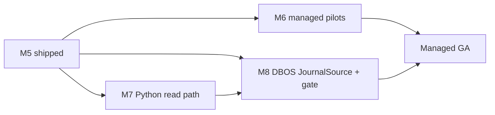

# durabl — Roadmap (M6+)

**As of:** 2026-06-02 · **Shipped through:** M5 (+ parallel tracks on `main`)

M0–M5 are **gated and evidenced** on Restate — see [`docs/build-status.md`](build-status.md).
This document is the **honest post-M5 plan**: what is not built yet, what “parity”
means, and what we will not pretend to ship.

Phase 0 concluded the **durable execution engine** wedge is closed; durabl’s
product is a **neutral journal + replay/fork/HITL layer** on a proven substrate
([`docs/phase0/validation-report.md`](phase0/validation-report.md)). M6+ extends
that layer — it does **not** re-open “build our own engine.”

---

## Shipped (M0–M5) — summary

| Milestone | What you get | Gate |
|-----------|----------------|------|
| M0 | Logical fork + replay feasible without engine mods | spike |
| M1 | Portable step journal + structural exactly-once | `npm test` |
| M2 | Logical trajectory fork + inspect APIs | `npm run gate:m2` |
| M3 | Replay / time-travel + offline export + UI | `npm run gate:m3` |
| M4 | Model + deploy neutrality (config-only) | `npm run gate:m4` |
| M5 | HITL pause/resume across real restart + export | `npm run gate:m5` |

Extension tracks on `main`: live-provider gate (`gate:live`), hardening, HITL web UI
(`gate:hitl-ui`), DBOS `JournalSource` **stub only** ([`docs/SECOND-SUBSTRATE.md`](SECOND-SUBSTRATE.md)).

---

## M6 — Managed control plane (honest: not started)

**Goal:** Revenue and ops for teams that want durabl’s journal semantics without
running Restate + SQLite + UI themselves.

**Not in scope for M6 v1:** Replacing Restate’s durable execution core or competing
with Google AX as an engine.

| Capability | Intent | Status |
|------------|--------|--------|
| Hosted journal ingest | Durable step journal + effects in tenant-isolated storage | Planned |
| Retention + export compliance | Policy-driven retention; signed export bundles | Planned |
| RBAC + audit | Who can fork, resume HITL, export | Planned |
| Team replay UI | Same replay/fork/HITL UX as OSS `web/`, multi-tenant | Planned |
| SLA / HA substrate | We operate Restate (or customer VPC); not “magic durability” | Planned |

**OSS remains the proof surface:** adversarial gates, SIGKILL demos, offline export.
Managed is **optional**; Apache-2.0 core stays self-hostable.

**Exit criteria (before GA):** Design-partner pilots; parity with OSS export schema;
no regression on “substrate killed → offline replay still works” for tenant exports.

---

## M7 — Python SDK (second language)

Phase 0 Decision 3: **TypeScript-first, Python fast-follow** — agent builders split
across LangGraph, Pydantic AI, OpenAI Agents (Python) and TS stacks
([`validation-report.md` §2.3](phase0/validation-report.md#decision-3--languageecosystem-typescript-first-python-second-this-overrides-the-prior-briefs-dbos-for-postgres-lean-as-the-primary-ecosystem-driver)).

| Deliverable | Intent | Status |
|-------------|--------|--------|
| Python package | Same journal types + export/fork **read** APIs as TS | Planned |
| Reference agent loop | Thin wrapper calling Restate Python SDK (or HTTP to TS service) | Planned |
| Gate parity | At least one Python gate proving export → replay matches TS | Planned |

**Honest limit:** Python v1 may be **read-heavy** (replay, inspect, export) before
full write/fork/HITL parity with TS — documented per release.

---

## M8 — DBOS substrate parity (not the stub)

Today: `src/journal-source-dbos-stub.ts` types the plug-in surface; **no Postgres,
no DBOS runtime, no parity gate** ([`SECOND-SUBSTRATE.md`](SECOND-SUBSTRATE.md)).

**“Parity” means:**

1. `dbosJournalSource()` implements `JournalSource` with the **same semantics** as
   `liveJournalSource()` / `importJournalSource()` (trajectory, effects, lineage).
2. A gated path runs **M3-class offline replay** (and ideally M2 fork-read APIs)
   against a real DBOS-backed journal — not Restate-only reads dressed up as neutral.
3. Documented mapping: DBOS step rows → `JournalEntry` + `EffectRow` + idempotency keys.

**Not claimed:** Feature parity with DBOS’s own workflow authoring, or outperforming
DBOS as a library-in-process engine. We integrate **at the journal boundary** only.

**Why DBOS:** Phase 0 ranked it **lightest ops** (Postgres + library) for shops that
want Postgres simplicity alongside neutrality
([`validation-report.md` §2.2](phase0/validation-report.md#22-substrate-comparison)).

| Item | Status |
|------|--------|
| Stub + contract doc | ✅ |
| Real adapter + env (`DBOS_DATABASE_URL`) | Planned (M8) |
| `gate:dbos` or M8 subsection in `gate:m3` | Planned (M8) |

**Second substrate after DBOS (if any):** Temporal/AX adapters are **research-only**
until DBOS parity is proven — AX already ships `ax fork`; our value is portable
journal + replay UX, not replicating AX.

---

## Explicit non-goals (M6+)

- **Building a new durable execution engine** (commoditized per Phase 0; Google AX,
  Temporal, Restate, DBOS, Cloudflare all ship agent durability).
- **CRIU / process-snapshot fork** (rejected in Phase 0; logical step fork only).
- **“Better LangSmith” as primary pitch** — observability is crowded; we compete on
  **execution journal portability + offline fork/replay**, not trace volume alone.
- **Claiming DBOS or managed parity before gates exist.**

---

## Sequencing (recommended)

Parallel work is possible (M7 + M8); **managed GA** should not ship without export
schema stability from M3/M5 and at least one design-partner success story.

---

## Related

- Build status: [`build-status.md`](build-status.md)
- Competition (factual): [`COMPARISON.md`](COMPARISON.md)
- Funding / GTM: [`FUNDING.md`](FUNDING.md)
- Risks: [`RISKS.md`](RISKS.md)
- Phase 0: [`phase0/validation-report.md`](phase0/validation-report.md)
