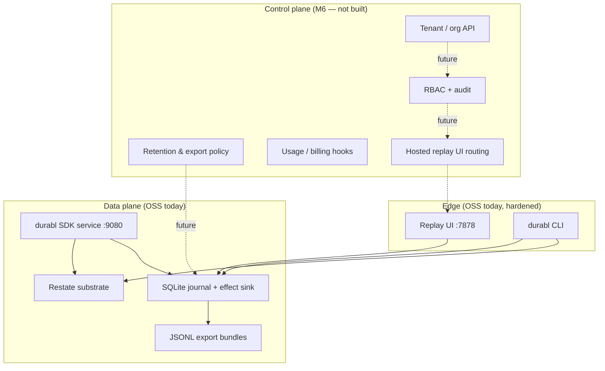

# Managed control plane — architecture (documented MVP)

**Status:** Architecture and boundaries only. **No hosted durabl SaaS exists.**  
**Shipped today:** Single-tenant, self-hosted OSS (Restate + SQLite journal + replay UI).  
**Related:** [`m6-saas.md`](m6-saas.md) · [`../ROADMAP.md`](../ROADMAP.md) § M6 · [`../FUNDING.md`](../FUNDING.md)

---

## Purpose

The **managed control plane** is the future operational layer that would run durabl
for teams who do not want to operate Restate, journal storage, retention, and the
replay UI themselves. It is **not** a second durable execution engine and **not** a
replacement for the portable journal product surface in OSS.

Capital and roadmap treat this as **post–v0.1 revenue path** (see funding narrative),
not as something implied by the current binary.

---

## What exists today (honest)

| Component | Today | Notes |
|-----------|--------|--------|
| Hosted ingest API | **No** | Journal writes happen in-process via Restate + local SQLite |
| Multi-tenant isolation | **No** | One `DURABL_DATA_DIR` / journal DB per deployment |
| Team RBAC / audit | **No** | Optional `DURABL_API_KEY` on mutating `/api/*` only (single shared secret) |
| Managed replay UI | **No** | `durabl ui` / `dist/cli.js ui` — operator-run, localhost-first |
| SLA / HA substrate | **No** | Operators run `restate-server` (or k8s sample in `deploy/k8s/`) |

Proof surface remains **OSS gates** (`npm run gate:all`, SIGKILL demos, offline export).

---

## Control plane vs data plane

| Plane | Responsibility | Owns durability? |
|-------|----------------|------------------|
| **Data plane** | Step journal semantics, effect dedup, Restate workflow bodies, export schema | **Yes** (via Restate + journal) |
| **Control plane** | Tenants, authZ, retention, hosted UI routing, ops of substrate per tenant | **No** — orchestrates and isolates data-plane resources |

The control plane must **not** re-implement `recordStep`, fork seeding, or effect
exactly-once logic; those stay in OSS `src/journal.ts` / `src/effect-sink.ts`.

---

## Deployment model (target)

### Phase 0 — documented only (this doc)

No cloud footprint. Operators follow [`../OPERATOR.md`](../OPERATOR.md) and
[`../../deploy/k8s/README.md`](../../deploy/k8s/README.md).

### Phase 1 — single-tenant “managed lite” (design partner)

One durabl **cell** per customer (dedicated namespace or account):

- Restate + SDK service + UI per cell
- Object store or PVC for `journal.db` / backups; JSONL export for compliance
- Shared-secret or SSO at ingress; still **one tenant per cell**

### Phase 2 — multi-tenant SaaS (M6)

Shared control plane API; **hard tenant boundary** on every read/write:

- Tenant ID on all journal rows and API routes (see [`m6-saas.md`](m6-saas.md))
- Per-tenant Restate namespace or isolated clusters (TBD — ops cost vs blast radius)
- Hosted UI resolves tenant from auth token, never from client-supplied query alone

**Not in M6 v1:** Customer VPC-only cells are a **variant** of Phase 1, not the first multi-tenant pool.

---

## Tenancy boundaries (target)

| Boundary | OSS today | M6 target |
|----------|-----------|-----------|
| Journal SQLite file | One DB per host | One logical DB **or** schema partition per `tenant_id` |
| Restate invocations | Global service name | Namespace / deployment per tenant or strong key prefix |
| Export bundles | Unscoped JSONL | Signed exports include `tenant_id` in envelope metadata |
| Replay UI | All runs visible to process | Filter by authenticated tenant |
| API keys | Single `DURABL_API_KEY` | Per-tenant keys or OIDC claims → tenant |

**Invariant:** A request must not read or mutate another tenant’s `runId` / journal
prefix. Enforcement belongs in the control plane **and** data-plane query layer.

Reserved env stub (no behavior yet): `DURABL_TENANT_ID` — see [`../OPERATOR.md`](../OPERATOR.md).

---

## Authentication and authorization (target)

### Today (OSS)

| Mechanism | Scope |
|-----------|--------|
| `DURABL_API_KEY` | Optional shared secret for mutating `/api/*` when UI is exposed |
| Localhost default bind | Reduces accidental exposure |
| CORS allowlist | `DURABL_CORS_ORIGINS` |

No users, orgs, or roles. GET replay routes are unauthenticated unless edge proxy adds policy.

### M6 control plane (planned)

| Layer | Intent |
|-------|--------|
| **Identity** | OIDC / SAML for humans; API keys or mTLS for automation |
| **AuthZ** | Roles: viewer (replay), operator (fork/resume HITL), admin (export policy, retention) |
| **Audit** | Append-only log: who forked, resumed HITL, exported bundle (no journal secrets in audit) |

Auth terminates at the **control plane edge**; data plane receives a signed internal
tenant context (implementation TBD — not shipped).

---

## Data residency and export

OSS already supports **offline replay** from JSONL with Restate stopped ([`../m3-observability-replay.md`](../m3-observability-replay.md)).

Managed layer adds:

- Retention policies (per tenant)
- Compliance export (same schema as OSS, plus control-plane metadata)
- **No regression:** tenant export must replay in OSS CLI without hosted connectivity

---

## Relationship to Restate and k8s sample

- **Engine:** Restate remains the default substrate; managed ops may run Restate-as-a-service per tenant.
- **Reference deploy:** `deploy/k8s/` is **M4 external** single-tenant sample — not multi-tenant SaaS.
- **SDK registration:** Operators still register `dist/service.js` with Restate admin after deploy.

---

## Explicit non-goals

- Building a proprietary durable execution engine
- Implying `https://cloud.durabl.*` or any hosted endpoint exists today
- Weakening OSS self-host story or export portability for managed convenience

---

## Exit criteria (before managed GA)

Aligned with [`../ROADMAP.md`](../ROADMAP.md) § M6:

1. Design-partner pilots on Phase 1 cells
2. Export schema parity with OSS; offline replay verified per tenant export
3. Tenant isolation tests (automated) on journal + API paths
4. RBAC + audit spec implemented and reviewed (security)

Until then, treat **managed control plane** as **documented MVP / NOT-PLANNED for implementation** on main.
