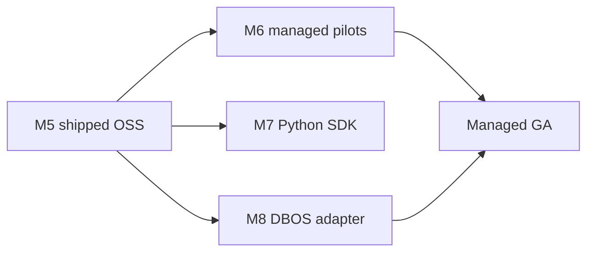

# M6 — multi-tenant SaaS roadmap

**Status:** Roadmap + architecture only. **Not implemented.** Not a v0.1 ship blocker.  
**Control plane detail:** [`control-plane.md`](control-plane.md)  
**Milestone table:** [`../ROADMAP.md`](../ROADMAP.md) § M6

---

## Honest summary

| Question | Answer |
|----------|--------|
| Is durabl SaaS live? | **No** |
| Can I sign up for hosted durabl? | **No** |
| What ships on `main`? | Single-tenant self-host (Apache-2.0 core) |
| What is M6? | Future **managed, multi-tenant** product layer on top of OSS journal semantics |

CEO/autoplan forward scope **frozen** M6 out of v0.1; this doc closes the architecture
narrative without pretending production multi-tenancy exists.

---

## Single-tenant self-host (today)

What operators actually run:

```text
┌─────────────────────────────────────────────────────────┐
│  One deployment = one implicit tenant (no tenant_id)   │
├─────────────────────────────────────────────────────────┤
│  durabl CLI  ·  replay UI (:7878)  ·  optional API key │
│       ↓              ↓                                  │
│  SQLite journal + effect sink (DURABL_DATA_DIR)         │
│       ↓                                                 │
│  Restate (ingress :8080) → SDK service (:9080)          │
│       ↓                                                 │
│  AgentRun / HitlAgentRun workflows                      │
└─────────────────────────────────────────────────────────┘
```

| Capability | Shipped | Gate / doc |
|------------|---------|------------|
| Portable step journal + export | Yes | M1, M3 |
| Logical fork | Yes | M2 |
| Offline replay (substrate killed) | Yes | M3 |
| HITL pause/resume (live ingress) | Yes | M5 |
| Provider/deploy neutrality | Yes | M4 |
| Per-tenant isolation | **No** | — |
| Hosted signup / billing | **No** | — |

Operator reference: [`../OPERATOR.md`](../OPERATOR.md), [`../QUICKSTART.md`](../QUICKSTART.md).

---

## M6 multi-tenant SaaS (target)

**Goal:** Teams get durabl journal + replay/fork/HITL **without** running Restate and SQLite ops; durabl operates (or provisions) the data plane per tenant with a shared control plane.

### Capability matrix

| Capability | Self-host today | M6 target | Notes |
|------------|-----------------|-----------|--------|
| Journal ingest | In-process via Restate | Hosted ingest + same schema | Must not fork schema silently |
| Storage | Local SQLite | Tenant-isolated store (SQLite per tenant or Postgres — TBD) | See risks in [`../RISKS.md`](../RISKS.md) |
| Replay / fork / HITL UX | OSS `web/` + CLI | Same UX, tenant-scoped | Feature parity claim, not new engine |
| Auth | Optional single API key | OIDC + RBAC | [`control-plane.md`](control-plane.md) |
| Retention / compliance | Operator-managed | Policy-driven | Signed exports |
| Billing / metering | N/A | Usage hooks | Out of core OSS |
| Offline export | Yes | Yes, per tenant | Required for parity |

### Tenancy model (planned)

- **Tenant** — billing + isolation root (org)
- **Project / workspace** — optional sub-scope for runs (TBD)
- **Run** — existing `runId`; must be unique **within tenant**, not globally unless prefixed

Enforcement layers (all required before GA):

1. **Control plane** — issue tokens with `tenant_id` claim
2. **API / UI** — reject cross-tenant `runId` access
3. **Journal store** — partition key `tenant_id` on all rows
4. **Restate** — namespace or deployment isolation per tenant (ops decision)

### Environment: `DURABL_TENANT_ID`

| Setting | OSS behavior | M6 behavior (future) |
|---------|--------------|----------------------|
| Unset | Single-tenant default (current) | Invalid in hosted mode |
| Set (non-empty) | **No-op** — reserved, exposed in `config` for forward compatibility | Selects tenant partition for this process |

OSS documents the stub so operators and Helm charts can set it early without behavior change.

---

## Sequencing vs other milestones

From [`../ROADMAP.md`](../ROADMAP.md):



- **M6** can parallel **M7** / **M8**; managed GA should not ship without stable M3/M5 export schema.
- **M6 does not require** DBOS or Python for first pilots (Restate + SQLite/Postgres per cell is enough).

---

## What M6 is not

- A replacement for LangSmith-style trace SaaS (we sell **execution journal** portability)
- A new durable engine (Phase 0 NO-GO still applies)
- A commitment to a specific cloud vendor in OSS repo
- Automatic migration from self-host to SaaS without explicit export/import

---

## Migration path (conceptual)

1. **Self-host → design-partner cell:** Export JSONL (`export-bundle`); import into dedicated cell; validate replay/fork.
2. **Cell → shared SaaS:** Re-export with tenant metadata envelope (schema version bump — future ADR).
3. **SaaS → self-host:** Always supported via same JSONL export (vendor exit).

No automated “click migrate” exists today.

---

## Risks and kill criteria

| Risk | Mitigation |
|------|------------|
| Weak tenant isolation | Mandatory isolation tests; security review before GA |
| Ops cost of Restate per tenant | Phase 1 dedicated cells before dense multi-tenant pool |
| Schema drift hosted vs OSS | Single `JournalEntry` schema; versioned exports |
| Market prefers AX end-to-end | Monitor per [`../FUNDING.md`](../FUNDING.md) kill criteria |

---

## Documentation status (closure)

| Item | Status |
|------|--------|
| Architecture docs | **Done** (this file + `control-plane.md`) |
| Implementation | **NOT-PLANNED** until new milestone + gates |
| Hosted service | **Does not exist** |

For funding / GTM wording, use **“future managed layer”** — not “available now.”
