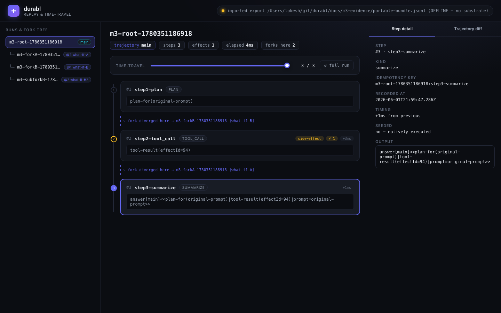
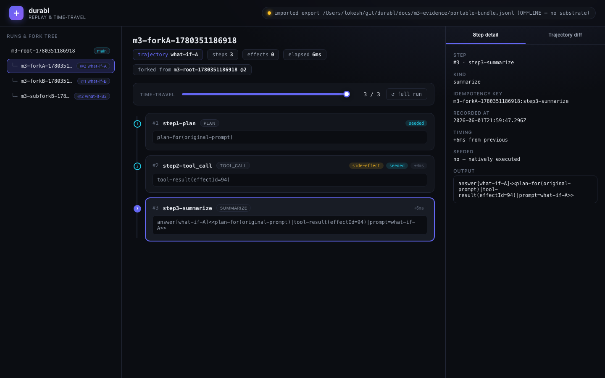
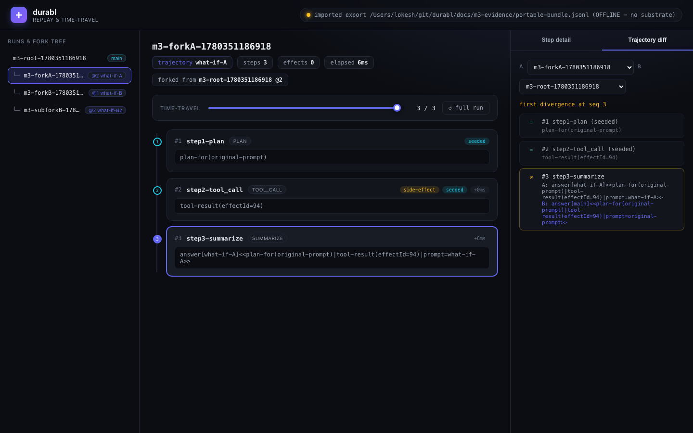
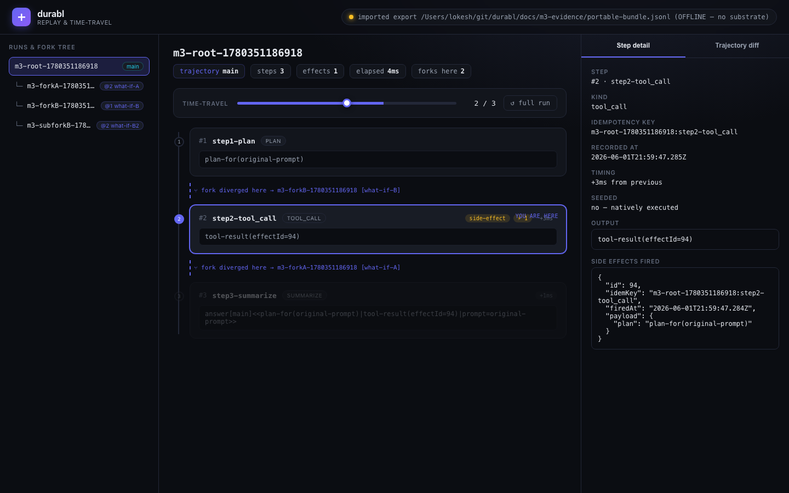

# durabl M3 — Observability & Replay (the wedge product)

**Date:** 2026-06-01
**Status:** PRODUCTION milestone. This is the re-scoped **wedge** itself: a
neutral, self-hostable **replay / time-travel debugging** read surface over the
portable agent execution journal (validation-report STATUS; build-plan §5 M3).
**Builds on:** M1 (portable step journal + structural exactly-once) and M2 (logical
step-level fork + read APIs: `inspectRun`, `lineage`, `listForks`, `forkTree`,
`diffTrajectories`, `exportJsonl(--meta)`). M3 does **not** rewrite the durable core
or the fork layer — it is a pure **read surface** (PRD §3.4) over the journal.

> The differentiator vs the crowded observability market
> (LangSmith/AgentOps/Braintrust/Langfuse): **self-hosted + neutral + the journal
> is portable and lives in your infra + replay/fork over that journal.** M3 proves
> the portability claim is real — you can replay a run *and its whole fork tree*
> from an exported JSONL file with **no substrate running at all**.

---

## 1. What M3 adds

| Concern | Before (M1/M2) | M3 (this milestone) |
|---|---|---|
| Reconstruction | `trajectory()`, `inspectRun()` over live SQLite | `replay.ts`: `reconstruct()` over a **`JournalSource`** — live journal **or** an imported JSONL export, identical code |
| Substrate independence | implied | **structural**: replay reads only a `JournalSource`; the engine cannot touch Restate (proven by killing it) |
| Time-travel | — | `stateAt(source, runId, N)`: state + effect set **as of step N**, plus the forks that diverged by N |
| Portability | `exportJsonl(--meta)` (lineage) | `exportJsonlWithEffects` + `exportBundleJsonl` (run + **whole fork tree** + effects), and `importJournalSource()` to replay it offline |
| Divergence assertion | — | `assertReplayMatches(a,b)`: **replay-divergence = none** (step seq + per-step output + effect set) |
| Delivery surface | CLI inspect/diff/tree | **local web UI** (timeline, fork tree, step detail, trajectory diff, time-travel scrubber) + CLI `replay` / `state-at` / `ui` |

New source on top of `src/` (durable core + fork layer unchanged):

```
src/journal-source.ts   → JournalSource interface; liveJournalSource() + importJournalSource(jsonl)
                          (the substrate-independence boundary; parseExport for the portable format)
src/replay.ts           → reconstruct / stateAt / divergencePoints / assertReplayMatches (read-only engine)
src/inspect-source.ts   → forkTreeFrom / lineageFrom / diffTrajectoriesFrom over a JournalSource
src/server.ts           → zero-dep node:http server: read APIs + static UI; localhost-bound
src/harness/run-m3-gate.ts → the M3 adversarial gate (real run on Restate, then Restate KILLED)
web/                    → the replay UI (index.html + app.css + app.js); vanilla, zero deps
scripts/capture-ui.mjs  → standalone headless screenshot capturer (gstack browse)
```

Additive-only changes to existing files: `journal.ts` gained
`exportJsonlWithEffects` / `exportBundleJsonl` (export read path); `cli.ts` gained
`replay`, `state-at`, `export-bundle`, `ui`; `index.ts` re-exports the M3 surface.
M1 still passes **10/10**, M2 still passes **6/6** (no regression).

---

## 2. Architecture — substrate-independent reconstruction

The replay engine reads a run **only** through the `JournalSource` interface:

```ts
interface JournalSource {
  readonly origin: string;
  trajectory(runId): JournalEntry[];
  runMeta(runId): RunMeta | undefined;
  childRuns(parentRunId): RunMeta[];
  effectsFor(runId): EffectRow[];
  allRunIds(): string[];
}
```

Two implementations, one engine:

- **`liveJournalSource()`** — reads the local SQLite step journal as produced by an
  M1/M2 run on the Restate substrate.
- **`importJournalSource(jsonl)`** — hydrates an **in-memory** journal purely from a
  portable JSONL export string. **No DB, no Restate, no substrate.**

Because `reconstruct()`, `stateAt()`, the fork tree, and the diff all take a
`JournalSource`, the identical reconstruction code runs against the live journal
and against an export with nothing else running. **That is the
substrate-independence proof, made structural rather than asserted** — the engine
has no API by which it *could* read live Restate state.

### The portable format (what travels)

`exportBundleJsonl(rootRunId)` emits one self-describing JSONL bundle for the run
**and its whole descendant fork tree**: tagged `run_meta` (lineage), `step`, and
`effect` lines. No Restate/engine fields leak. Example (first lines of the real
gate bundle, `docs/m3-evidence/portable-bundle.jsonl`):

```json
{"record":"run_meta","schema":1,"runId":"m3-root-…","parentRun":null,"forkedAtSeq":null,"trajectory":"main",…}
{"record":"step","schema":1,"runId":"m3-root-…","seq":2,"stepName":"step2-tool_call","kind":"tool_call","idemKey":"m3-root-…:step2-tool_call","output":"tool-result(effectId=94)","sideEffect":true,"seededFrom":null,…}
{"record":"effect","id":94,"runId":"m3-root-…","stepName":"step2-tool_call","idemKey":"m3-root-…:step2-tool_call","payload":{"plan":"plan-for(original-prompt)"},…}
{"record":"run_meta","schema":1,"runId":"m3-forkA-…","parentRun":"m3-root-…","forkedAtSeq":2,"trajectory":"what-if-A",…}
```

`importJournalSource` also accepts the bare M1 export (one `JournalEntry` per line)
and the tagged M2 export — backward compatible.

---

## 3. The M3 gate (real evidence)

Single command, CI-suitable for the non-UI parts:

```bash
npm run gate:m3      # == npm run test:m3
```

It wipes state, starts a **real** `restate-server`, produces a real multi-fork run
with the existing M1/M2 workflow, then runs five sub-gates. **G2–G5 reconstruct
only AFTER Restate is killed.** Every number is read from real data.

| Sub-gate | Proves |
|---|---|
| **G1 reconstruct-matches-reality** | reconstructing the run from the live journal reproduces the **exact** step sequence + effect set + outcome that actually happened (`replay_divergence=none`); reconstructing twice is deterministically identical |
| **G2 offline-from-export (portability proof)** | after the substrate is **killed** (`restate_health_unreachable=true`, pids dead), the run **and all its forks** reconstruct from the exported JSONL bundle alone, byte-identical to the live reconstruction (`*_divergence=none`) |
| **G3 time-travel-correctness** | `stateAt(N)` (offline) reports the correct as-of output + effect set (effect present at N=2, absent at N=1), the forks that diverged by N, and rejects out-of-range N |
| **G4 fork-tree-and-diff** | the fork tree (`root → [forkA, forkB → [subForkB]]`) and a trajectory diff (`first_divergence=3`, seq 1–2 same/seeded, seq 3 changed) reconstruct correctly **offline** |
| **G5 ui-api-offline** | every read endpoint the web UI uses (`/api/runs`, `/api/replay`, `/api/tree`, `/api/diff`, `/api/state-at`) answers correctly from the **imported export with no substrate** — the UI's entire data path is offline |

> Why the browser screenshots are captured by a separate process: the UI server
> and the gstack browse daemon both need the event loop; driving the daemon from
> inside the server's process deadlocked. G5 therefore hard-verifies the UI's
> **data path** offline (the substantive proof the UI works without a substrate),
> and the PNGs below are captured by `npm run capture:ui` (a standalone process)
> against the same offline bundle. Screenshots are read back and embedded as
> evidence in §5.

### 3.1 REAL gate output (pasted verbatim)

Full log: [`m3-evidence/gate-evidence.log`](m3-evidence/gate-evidence.log). Run on
2026-06-01, Node 26, Restate `1.6.2` / SDK `1.14.4`, `npm run gate:m3` **exit code 0**.

```
[GATE PASS] G1 reconstruct-matches-reality
  reconstructed_from=live-sqlite-journal steps=[step1-plan,step2-tool_call,step3-summarize] effects=1(expect 1) outcome_matches_substrate_result=true replay_divergence=none outcome="answer[main]<<plan-for(original-prompt)|tool-result(effectId=94)|prompt=original-prompt>>"

# exported portable bundle (18 lines) → docs/m3-evidence/portable-bundle.jsonl

# substrate killed: restate_health_unreachable=true service_pids_dead=true

[GATE PASS] G2 offline-from-export (portability proof)
  substrate_dead=true reconstructed_from=imported:portable-bundle.jsonl root_divergence=none forkA_divergence=none forkB_divergence=none subforkB_divergence=none forkB_own_effect=1(expect 1 — fork@1 fires own effect) forkA_seeded_no_refire=2seeded

[GATE PASS] G3 time-travel-correctness
  at_step2: steps=2(expect 2) currentOutput_matches=true effects_as_of_2=1(expect 1) diverged=[@1:m3-forkB-…,@2:m3-forkA-…] at_step1: effects=0(expect 0) diverged_has_forkB=true out_of_range_rejected=true

[GATE PASS] G4 fork-tree-and-diff
  tree=m3-root-…->[m3-forkA-…,m3-forkB-…], m3-forkB-…->[m3-subforkB-…] tree_ok=true diff(root,forkA): first_divergence=3(expect 3) seq_status=[1:same,2:same,3:changed] diff_ok=true

# replay UI serving OFFLINE export at http://127.0.0.1:7879

[GATE PASS] G5 ui-api-offline
  origin=imported:…/portable-bundle.jsonl origin_imported=true /api/runs=4runs(true) /api/replay steps=3 effects=1 from=imported:…(true) /api/tree children=2(true) /api/diff firstDiv=3(true) /api/state-at n=2 steps=2(true) — UI data path fully offline, no substrate

================ M3 GATE SUMMARY ================
PASS  G1 reconstruct-matches-reality
PASS  G2 offline-from-export (portability proof)
PASS  G3 time-travel-correctness
PASS  G4 fork-tree-and-diff
PASS  G5 ui-api-offline
------------------------------------------------
5/5 gates passed
VERDICT: GATE PASSED
================================================
```

### 3.2 The two differentiator gates, in plain terms

- **replay-divergence = none (G1):** the replayed step sequence + effects EXACTLY
  match what actually happened for a real run produced by the M1/M2 harness.
- **offline-from-export reconstruction, no substrate (G2):** Restate is genuinely
  **killed** (`restate_health_unreachable=true`, service pids dead) and the full run
  + its forks reconstruct from the JSONL export alone, identical to live. This is the
  "your journal lives in your infra, portable, not a lab's" proof.

---

## 4. Running it

```bash
# Run the gate (produces the run, kills the substrate, asserts everything, exit 0):
npm run gate:m3

# Reconstruct / time-travel from the live journal:
node dist/cli.js replay <runId>
node dist/cli.js state-at <runId> --n 2

# Reconstruct / time-travel from a portable EXPORT, with NO substrate running:
node dist/cli.js export-bundle <rootRunId> > run.jsonl
node dist/cli.js replay   <runId> --from run.jsonl
node dist/cli.js state-at <runId> --n 2 --from run.jsonl

# Launch the local replay UI (localhost only) over the live journal:
npm run ui                 # http://127.0.0.1:7878
# …or over a portable export, fully offline (no substrate):
node dist/cli.js ui --from run.jsonl

# Capture UI screenshots headlessly (standalone process; needs gstack browse):
npm run capture:ui
```

Config is env-var only (`DURABL_UI_HOST`, `DURABL_UI_PORT`, journal/effect DB
paths). The server **binds `127.0.0.1` by default** — the journal is never exposed
off the machine. Read-only: no endpoint mutates state or invokes the substrate. No
secrets are read or logged. Fully local — no cloud, no external service.

---

## 5. The replay UI (screenshots — captured OFFLINE from the export)

All four were captured by `npm run capture:ui` against the **imported JSONL
export with no substrate running** (note the amber "OFFLINE — no substrate" pill,
top-right of every shot). Source: `docs/m3-evidence/screenshots/`.

**Timeline + step detail** — the run reconstructed from the portable journal: step
sequence, side-effect marker, fork-divergence markers, timing, outcome.



**Fork tree + a fork's trajectory** — `m3-forkA` forked from root @2; steps 1–2 are
marked **seeded** and `effects 0` (no re-fire — the M2 idempotency guarantee, made
visible), step 3 diverges to `answer[what-if-A]`.



**Trajectory diff** — root vs forkA: `first divergence at seq 3`; seq 1–2 `=` (same,
seeded prefix), seq 3 `≠` (changed) with both outputs side-by-side.



**Time-travel** — scrubbed to step 2/3 of the root run: step 2 is "you are here",
step 3 is greyed as future, and the detail panel shows the **side effect fired as
of step N** (payload + idempotency key).



---

## 6. Limits (do not over-claim)

- Same single-node envelope as M1/M2 (no multi-partition / network-partition /
  clock-skew testing — substrate concern, and irrelevant to a read surface).
- Steps are synthetic (no real LLM/tool latency); timing in the UI is the real
  `recordedAt` deltas of the journaled run, which for these fast synthetic runs are
  small (ms). The replay/time-travel/diff logic is content-agnostic.
- G5 hard-verifies the UI's **read APIs** offline (its full data path). The browser
  **screenshots** are captured by a separate process (`npm run capture:ui`) because
  the browse daemon cannot be driven from inside the server's own event loop; they
  are committed as evidence and embedded above. The replay engine + CLI + APIs are
  the CI-gated, mock-free parts.
- This is the **read surface only** (PRD §3.4). No write-back, no re-execution from
  the UI, no neutrality/multi-provider work (M4) and no HITL (M5). Export already
  existed (M1/M2); M3 only *reads* it.

---

## 7. STATUS / M4 go-no-go

**STATUS: DONE.** The M3 gate passes **5/5** with real evidence: a real M1/M2 run is
reconstructed from its journal with **replay-divergence = none** (G1); after the
Restate substrate is **genuinely killed**, the run **and its whole fork tree**
reconstruct from a portable JSONL export alone, byte-identical to live (G2 — the
portability proof); time-travel to step N reports correct as-of state/effects and
rejects out-of-range (G3); the fork tree + trajectory diff reconstruct correctly
offline (G4); and the web UI's entire read-API data path serves the offline export
with no substrate (G5). The replay/time-travel UI is real, modern, self-hostable,
localhost-bound, and was screenshotted offline (§5). M1 (10/10) and M2 (6/6) still
pass — the durable core and fork layer are unchanged.

**M4 (neutrality / multi-provider proof) go/no-go: GO.** The read surface is the
demonstrable, lower-correctness-risk beachhead, and it now provably runs over a
**portable journal that outlives the substrate** — the exact claim M4 generalizes
(journal-format parity across substrates + a second provider/SDK). Nothing in M3
binds the reconstruction to Restate (the `JournalSource` boundary is the seam M4
plugs a second substrate into). Phase 0 kill-switches remain the watch items (a
funded neutral self-hosted replay+fork competitor; Google AX adding cross-substrate
portability + a polished replay UI).
